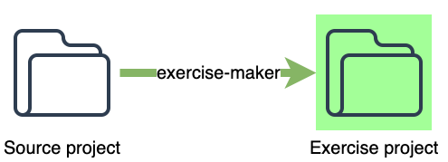

# Exercise Maker Introduction
a maven plugin that **produces the corresponding exercise files based on the source project**. It removes some lines according to specific marks written in the comments to produce the exercise files. So that when we modify an example file slightly in the future, we don't have to create the corresponding exercise file again manually.




# Turn Your Training/Example Project into an Exercise Project
According to psychology study, people just can remember 30% of what they hear. But people can remember 60% of what they do. When I give a training to trainees, I will give them an exercise project that contains incomplete codes and request them to complete the code during a training. For Example, this is my original code:

```java
public class HelloVM {

    public void hello(){
        hello = "hello world";
    }
}
```

Then I will create an exercise file by removing several lines for trainees to implement by themselves like:

```java
public class HelloVM {
    //TODO, write a hello method to initialize "hello"
}
	
```

If I have to create these exercise files manually, it's hard to maintain when the original code changes in the future. So I need a way to automatically produce the exercise files.


# Feature
* Put **exercise mark** inside a comment line of a source code (including  zul, java, css, javascript) to produce the corresponding file for the exercise by removing the specified lines below the **exercise mark**, e.g.

`<!-- TODO, 2-5, hint -->`

The plugin removes the lines starting from the 2nd to the 5th lines (included) below TODO.
* If a file doesn't contain any exercise mark, do not produce any exercise file.


# Exercise Mark Syntax
a valid exercise mark should at least contains 3 parts:
`TODO, [EXERCISE RANGE], [HINT]`

## 1. TODO
The keyword that indicates the exercise mark, must be uppercase

## 2. `[EXERCISE RANGE]`:
Specifies one of the following:
1. one number: number of lines to delete e.g. `13`
2. a range: e.g. `1-3`.
* line number starts from **1**

## 3. `[HINT]` 
* a hint is left for trainees to read when doing exercises
* it can contain a comma, the plugin just checks the first 2 parts


the plugin ignores invalid marks

# Usage
Put exercise mark inside a comment line to specify a block to be removed for exercises

## zul
`<!-- TODO, 5, add a button -->`

## java
`// TODO, 8, implement a feature`


# Plugin Usage
Check /src/test/pom.xml

```xml
<build>
    <plugins>
        <plugin>
            <groupId>org.zkoss.training</groupId>
            <artifactId>exercise-maker</artifactId>
            <version>1.0.0</version>
            <!-- optional, here are default paths:
            <configuration>
                <sourceDirectory>src/test/</sourceDirectory>
                <outputDirectory>src/exercise/</outputDirectory>
            </configuration>
            -->
        </plugin>
    </plugins>
</build>
```
* The default goal is `make`
* The default phase is `process-sources"` 

# Run Test Cases
Install exercise-maker into the local repository before running test cases.


# Reference
[Plugin Developers Centre](https://maven.apache.org/plugin-developers/index.html) 

# Publish
[jenkins2/Maven_update/PBFUM/](http://jenkins2/view/Maven_update/job/PBFUM/)